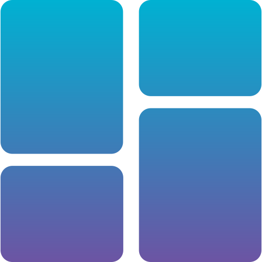

    
    <h1>
    	WinUI3 Template
	</h1>

**A template for WinUI 3, with support of tray icon, multi-thread window, splash screen, etc.**

## 🎁 Features

* Package / Unpackaged Mode
* Navigation View
* Setting Page
	* Language
	* Startup
	* Theme
	* Backdrop
* Tray Icon
* Window Creation
* Multi-thread Window
* Custom Program
* Single Instance
* Splash Screen
* Serilog Logging

## 🚗 Getting Started

* Replace in files
	* replace `WinUI3Template` with your own root namespace.
	* replace `WinUI3 Template` with your own app name.
	* replace `A template for WinUI 3.` with your own description.
	* replace `AuthorName` with your own name.
	* replace `Settings_Repository_NavigateUri` with your own repository.
	* replace `Settings_LicenseLink_NavigateUri` with your own license link.
	* replace `8f256a41-5ee3-4218-97c6-12e1f8d5c234` with your own GUID (PhoneProductId).
	* replace `445ab065-101e-45ff-80ab-45efcdf5dae5` with your own GUID (ToastActivatorCLSID).

> [!TIP]
> You can use `VSCode` to execute replace. Use Ctrl + Shift + S.

* Rename file names
	* rename `WinUI3Template` with your own project root name.

> [!TIP]
> You can use `PowerRename` module in `PowerToys` to execute replace.

* Custom project settings in the core project `csproj` file
	* Custom program: `<DefineConstants>DISABLE_XAML_GENERATED_MAIN;$(DefineConstants)</DefineConstants>`
	* Single instance: `<DefineConstants>SINGLE_INSTANCE;$(DefineConstants)</DefineConstants>`
	* Tray icon: `<DefineConstants>TRAY_ICON;$(DefineConstants)</DefineConstants>`
	* Splash screen: `<DefineConstants>SPLASH_SCREEN;$(DefineConstants)</DefineConstants>`

> [!TIP]
> If you don not need some features, you can remove the corresponding define constants.

* Implement TODOs
	* Initialize others things in `async Task ActivateAsync()` of `App.xaml.cs`.
	* Add the languages supported by the unpackaged app in `public static void Initialize()` of `AppLanguageHelper.cs`.

* Add a new window
	* Refer to `WindowsExtensions.cs` for more information.

## 🪧 Building

* Select the package / unpackaged mode.
* Build the solution in Visual Studio or run `dotnet build` from the command line.

## 📚 Reference

* Files: https://github.com/files-community/Files
* fluentui-system-icons: https://github.com/microsoft/fluentui-system-icons
* H.NotifyIcon: https://github.com/HavenDV/H.NotifyIcon
* ICONS8: https://icons8.com/icons
* Newtonsoft.Json: https://github.com/JamesNK/Newtonsoft.Json
* Template Studio for WinUI (C#): https://github.com/microsoft/TemplateStudio
* terminal: https://github.com/microsoft/terminal
* WinUI3Windows: https://github.com/smourier/WinUI3Windows
* WinUI3-Template: https://github.com/Jack251970/WinUI3-Template
* Windows Community Toolkit: https://github.com/CommunityToolkit/WindowsCommunityToolkit
* WinUIEx: https://github.com/dotMorten/WinUIEx